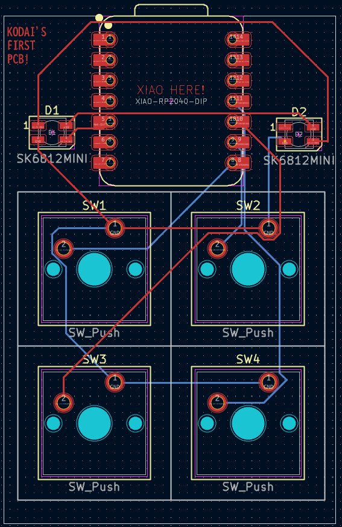
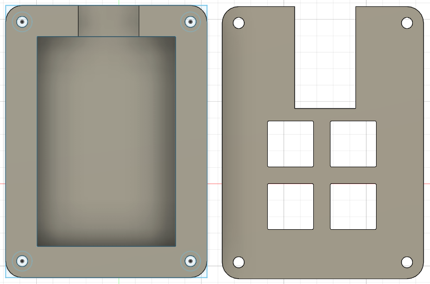

# Kodai's Thingy

## The Lore
I'm a high school student just beginning to learn how to build stuff. I came across an Instagram reel talking about Hackclub and I was interested so I decided to attempt this project. I've never used Fusion 360 and KiCAD before so this was definitely a learning experience. In all honesty, I followed the tutorial 1:1 just because I wanted to avoid complexities since this is my first time. However, I am definitely willing to make stuff of my own in the future.

## Use Case
This hackpad is meant to be used to help me animate in Blender. I created a hackpad using 4 switches, 1 rp2040, and 2 leds.

## BOM
- 4x Cherry MX Switches
- 2x SK6812 MINI Leds
- 1x XIAO RP2040
- 4x Blank DSA Keycaps
- 4x M3x16 Bolt
- 4x M3 Heatset

## Additional Items
- KMK firmware
- Top Case.stl
- Bottom Case.stl

